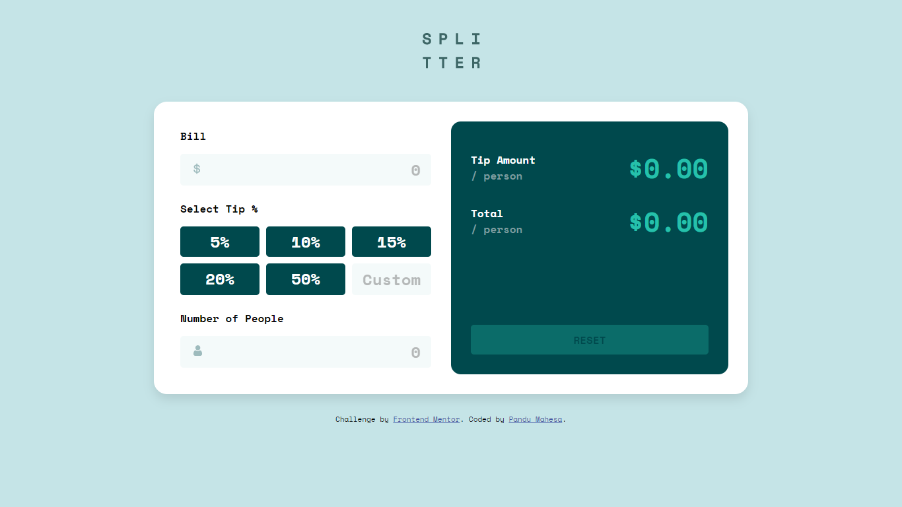

# Frontend Mentor - Tip calculator app solution

This is a solution to the [Tip calculator app challenge on Frontend Mentor](https://www.frontendmentor.io/challenges/tip-calculator-app-ugJNGbJUX). Frontend Mentor challenges help you improve your coding skills by building realistic projects.

## Table of contents

- [Overview](#overview)
  - [The challenge](#the-challenge)
  - [Screenshot](#screenshot)
  - [Links](#links)
- [My process](#my-process)
  - [Built with](#built-with)
- [Author](#author)

## Overview

### The challenge

Users should be able to:

- View the optimal layout for the app depending on their device's screen size
- See hover states for all interactive elements on the page
- Calculate the correct tip and total cost of the bill per person

### Screenshot

### Links

- Solution URL: [My Solution](https://www.frontendmentor.io/solutions/tip-calculator-using-vanilla-js-css-grid-and-flexbox-clzA5OTov)
- Live Site URL: [Github Pages](https://mahesa10.github.io/tip-calculator-app/)

## My process

### Built with

- Semantic HTML5 markup
- CSS custom properties
- Flexbox
- CSS Grid
- Vanilla JS

## Author

- Frontend Mentor - [@mahesa10](https://www.frontendmentor.io/profile/mahesa10)
- Twitter - [@pndmhs](https://www.twitter.com/pndmhs)